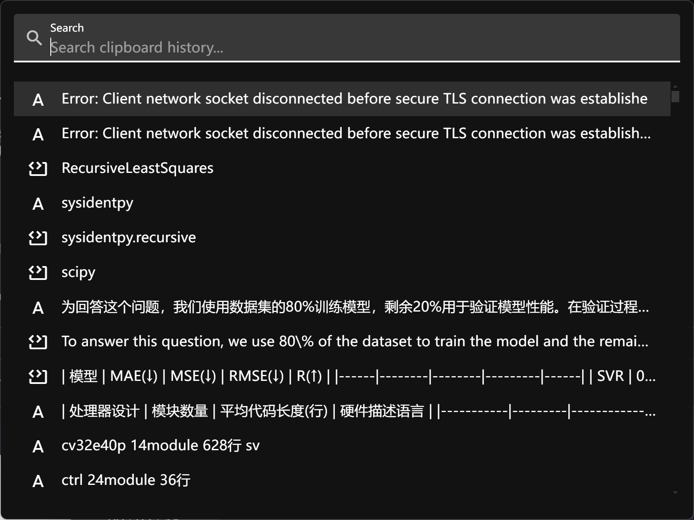

# DcPaste

<div align="center">
  <h3>一个简洁高效的跨平台剪贴板管理器</h3>
  <p>A Simple and Efficient Cross-platform Clipboard Manager</p>
</div>

## ✨ 特性 | Features

- 🚀 **轻量快速** - 基于 Electron 构建，启动迅速，占用资源少
- 📋 **多格式支持** - 支持纯文本、富文本(RTF)、HTML、图片、文件路径
- 🔍 **快速搜索** - 实时搜索历史记录，快速定位所需内容
- ⌨️ **键盘导航** - 支持方向键选择、Enter 确认，无需鼠标操作
- 🎯 **全局快捷键** - `Alt+D` 快速唤起/隐藏窗口
- 💾 **自动保存** - 剪贴板历史自动保存，重启不丢失
- 🗑️ **智能清理** - 自动清理 7 天前的历史记录
- 🎨 **主题适配** - 自动跟随系统深色/浅色主题
- 🔒 **隐私保护** - 系统锁屏时自动暂停监控
- 🪟 **无干扰设计** - 无边框窗口，失焦自动隐藏

## 📸 截图 | Screenshots

<div align="center">
  
  <p><i>DcPaste 主界面</i></p>
</div>

## 🖥️ 系统要求 | Requirements

- Windows 10/11
- macOS 10.13+
- Linux (支持 AppImage、Snap、Deb)

## 📦 安装 | Installation

### 从源码构建

1. 克隆仓库
```bash
git clone https://github.com/Duducoco/DcPaste.git
cd DcPaste
```

2. 安装依赖
```bash
yarn
```

3. 构建应用
```bash
# Windows
yarn build:win

# macOS
yarn build:mac

# Linux
yarn build:linux
```

构建完成后，安装包位于 `dist` 目录。

## 🚀 使用方法 | Usage

### 启动应用

应用启动后会自动最小化到系统托盘，不会显示主窗口。

### 快捷键

- `Alt+D` - 显示/隐藏剪贴板历史窗口
- `↑/↓` - 在历史记录中上下移动
- `Enter` - 选择当前项并写入剪贴板
- `Esc` - 隐藏窗口（失焦自动隐藏）

### 搜索功能

在搜索框中输入关键词可以实时过滤历史记录，支持：
- 文本内容搜索
- 富文本内容搜索
- 文件路径搜索

### 托盘菜单

右键点击托盘图标可以：
- 退出应用

## 🛠️ 开发 | Development

### 开发模式

```bash
# 启动开发服务器（支持热重载）
yarn dev
```

### 代码格式化

```bash
# 格式化代码
yarn format

# 运行 ESLint 检查并自动修复
yarn lint
```

### 构建测试

```bash
# 仅构建代码（不打包）
yarn build

# 构建并打包为未压缩目录（用于测试）
yarn build:unpack
```

### 生成应用图标

```bash
yarn electron:generate-icons
```

## 🏗️ 技术栈 | Tech Stack

- **框架**: [Electron](https://www.electronjs.org/) - 跨平台桌面应用框架
- **前端**: [Vue 3](https://vuejs.org/) - 渐进式 JavaScript 框架
- **UI 库**: [Vuetify 3](https://vuetifyjs.com/) - Material Design 组件库
- **构建工具**: [electron-vite](https://electron-vite.org/) - 快速的 Electron 开发构建工具
- **打包工具**: [electron-builder](https://www.electron.build/) - 应用打包和分发

### 核心依赖

- `electron-clipboard-ex` - 增强的剪贴板功能（支持文件路径读取）
- `electron-store` - 持久化配置存储
- `@johnlindquist/node-window-manager` - 跨平台窗口管理

## 📁 项目结构 | Project Structure

```
DcPaste/
├── src/
│   ├── main/               # 主进程
│   │   ├── clipboard/      # 剪贴板核心功能
│   │   │   ├── clipboardObserver.js   # 剪贴板监控
│   │   │   ├── clipboardHistory.js    # 历史记录管理
│   │   │   └── clipboardItem.js       # 数据模型
│   │   ├── ipc/            # IPC 通信处理
│   │   ├── windowManager.js           # 窗口管理
│   │   └── index.js        # 应用入口
│   ├── preload/            # 预加载脚本
│   └── renderer/           # 渲染进程（Vue 应用）
│       └── src/
│           └── view/
│               └── ClipBoard.vue      # 主界面组件
├── resources/              # 应用资源（图标等）
├── build/                  # 构建资源
└── dist/                   # 打包输出目录
```

## 🤝 贡献 | Contributing

欢迎提交 Issue 和 Pull Request！

## 📄 许可证 | License

本项目采用 MIT 许可证。

## 👨‍💻 作者 | Author

**Duducoco**

- GitHub: [@Duducoco](https://github.com/Duducoco)

---

<div align="center">
  如果这个项目对你有帮助，请给它一个 ⭐️
</div>
